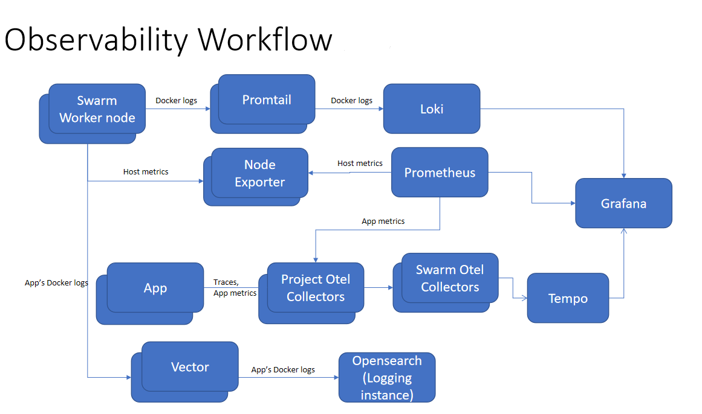

# Observability Platform (Trial version)

This is a trial version of the observability platform for testing on the laptop

The platform consists of the following apps:
- grafana - visualization
- tempo - trace management
- loki - log management
- prometheus - metrics management
- promtail - to pull docker logs to send to loki
- otel-collector - to collect metrics and traces from applications. Traces will be pushed to tempo while Prometheus will pull the metrics from the collector
- node exporter - gather host metrics for Prometheus to pull

To run this setup:
1. Git clone the observability-platform project from GitHub
2. Open the project using VS Code
3. Create 2 folders: `opensearch-data` and `tempo-data`
4. Open 4 split terminals in VS Code
5. We will start up the `obs-main-stack` first and then 4 apps under `obs-api-server-1-stack` and `obs-api-server-2-stack` 

## Starting up the obs-main-stack:
This stack consists of grafana, tempo, loki and prometheus

1. In the 1st terminal, go into obs-main-stack
1. Run `docker-compose up -d` to start up the obs-main-stack
1. Open Docker Engine Desktop to ensure all the apps are up and running

## Starting up the obs-app-stack:
### Starting up the obs-api-server-1-stack:
1. In the 2nd terminal, go into obs-api-server-1-stack
1. Note: Project `api-server-1` consists of 2 applications - `api-server-1a` and `api-server-1b`.
1. Run `docker-compose up -d` to start up the obs-api-server-1-stack
1. Open Docker Engine Desktop to ensure all the apps are up and running
1. To generate traffic for `api-server-1a`, type `python runner_script.py` in the terminal.
1. You will be prompted for a port number. Enter the port number exposed for `api-server-1a` in the docker-compose file.
1. Api calls will be made randomly to `api-server-1a`
1. In the 3rd terminal, go into `obs-api-server-1-stack`. Repeat Step 5 and 6 to generate traffic for `api-server-1b`

### Starting up the obs-api-server-2-stack:
Repeat the steps depicted under `Starting up the obs-api-server-1-stack` for `obs-api-server-2-stack` using terminal 4 accordingly. Project `api-server-2` only has 1 application `api-server-2a`.

## To view the dashboards:
1. Open the browser and type `http://localhost:3000`
1. The grafana front page will open. To log in, go to the `docker-compose.yaml` in `obs-main-stack` folder and look for the grafana service in it. The username and password are stated under environment.
1. There are 2 more accounts that can be used to log in to grafana: `user1` and `user2`. The passwords are all the same as `admin`'s password. 
1. `user1` will only view traces/logs/metrics related to applications under `api-server-1`. `user2` will only view traces/logs/metrics related to applications under `api-server-2`.

## Dashboards available
1. LogsDB - displays the running logs in the various docker containers
2. Node Exporter Full - displays host metrics of the VM/machine the node exporter container is running on
3. Opensearch Prometheus - displays the performance metrics of Opensearch. Requires the installation of the prometheus exporter plugin in every node of the Opensearch cluster
4. OpenTelemetry APM - View the usage and performance of the monitored APIs
5. Trace_dashboard - view the traces captured

## Access Control on dashboard
admin - administer - LogsDB (system logs), Node Exporter Full, Opensearch Prometheus, OpenTelemetry APM (all applications), Trace_dashboard (all applications)
user1 - administer - LogsDB, OpenTelemetry APM, Trace_dashboard (Only display info from project api-server-1)
user2 - administer - LogsDB, OpenTelemetry APM, Trace_dashboard (Only display info from project api-server-2)
