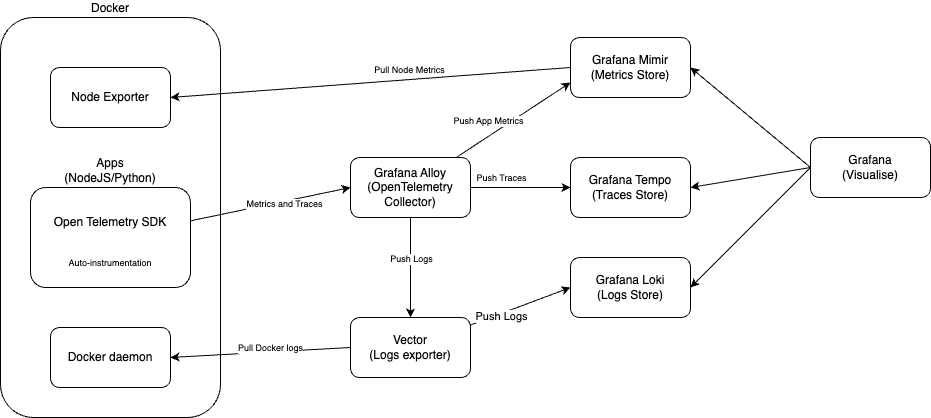

# Observability Platform

The platform implements the `Grafana LGTM` stack and consists of the following apps:

-   `Loki` - log management
-   `Grafana` - visualization
-   `Tempo` - trace management
-   `Mimir` - metrics management
-   `Vector` - logs collector, pushes to `Loki`
-   `Alloy` - OTEL collector. Collects metrics and traces from applications. Traces will be pushed to `Tempo` while metrics will be pushed to `Mimir`
-   `k6` - API load testing automation tool
-   `node-exporter` - exposes node metrics for prom to scrape
-   `cadvisor` - exposes container metrics for prom to scrape

> Some components of this stack may not work on Docker Desktop - Mac (cadvisor)

## To Run

1. `cd` to `./main`
1. Run `docker compose up -d --build`
1. Wait for all services to be up. (You can ignore the `fast-api-load-test` and `setup-db` service)

## To view the dashboards:

1. Open the browser and type `http://localhost:3000`
1. The grafana front page will open. To log in, go to the `docker-compose.yaml` in `main` and look for the grafana service in it. The username and password are stated under environment.

## Dashboards available

1. `Application Performance Monitoring` - Application Performance Metrics for monitoring the driver apps that are instrumented with `OpenTelemetry`
1. `Node Metrics` - displays host metrics of the VM/machine the node exporter container is running on
1. `Opensearch` - displays the performance metrics of Opensearch. Requires the installation of the prometheus exporter plugin in every node of the Opensearch cluster
1. `k6 Load Tests` - shows the API load testing metrics
1. `Docker Metrics` - shows the Docker container metrics
1. `Grafana` - shows the Grafana instance metrics
